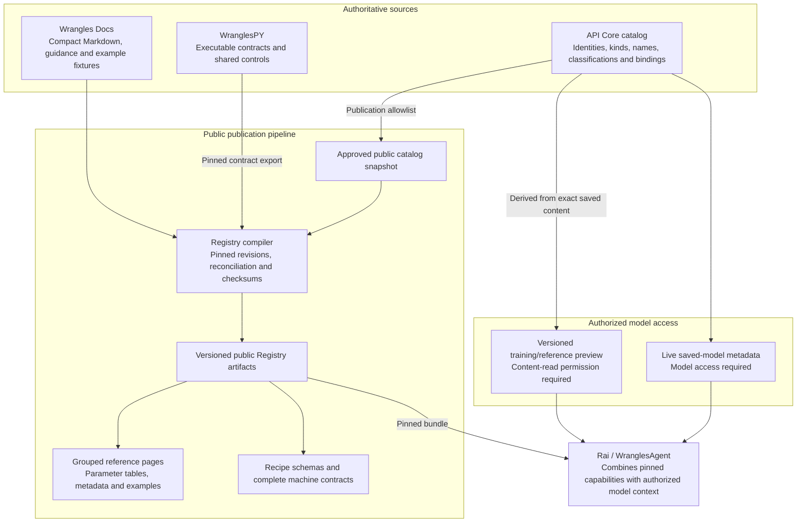

# Wrangles Docs

Documentation and Registry compilation for the Wrangles platform. The
Registry brings together catalog identities, executable contracts and editorial
content to produce complete, versioned reference material for people and tools.

## Registry design

**Status: pre-production implementation.** [Issue #32](https://github.com/wrangleworks/Wrangles-Docs/issues/32)
tracks the redesign. API Core now has `public.wrangles_catalog` and
`models.catalog_id`; Registry 0.3 imports the sanitized catalog table, joins it
to the pinned Docs and WranglesPY inputs, and publishes catalog IDs in the
compiled bundle. Public API publication, connectors, saved-model previews, and
full consumer cutover remain incomplete.

Each fact has one authoring owner. API Core supplies catalog information,
WranglesPY supplies the executable contract, and Docs supplies explanations and
examples. The compiler joins pinned inputs and reports conflicts instead of
silently choosing between competing definitions.

Private model metadata and training/reference previews do not enter the public
compiler inputs or published bundle. Rai combines them with the public Registry
at request time under the caller's authorization.

### Ownership and authoring

| Owner | Authored or generated responsibility |
| --- | --- |
| API Core | Central `catalog_id` rows in `wrangles_catalog`, existing model identities and `models.catalog_id` links, names, kinds, status, publication policy and access. Typed relationships remain planned. |
| WranglesPY | One structured executable contract maintained with the implementation: callable keys, parameters, defaults, enums, nested and conditional constraints, supported forwarded arguments, output semantics, runtime prerequisites and shared controls. |
| Wrangles Docs | Small catalog references, capability descriptions, explanatory prose, parameter-help supplements, curated recipes and input/output fixtures. |
| Registry compiler | Reconciled reference pages, recipe schemas, complete machine contracts and discovery artifacts, with source revisions and checksums. These are generated projections, not additional authoring sources. |
| Rai / WranglesAgent | Consumer compatibility and eligibility checks, authorized model selection and explicit execution binding. |

Mechanical signature facts are derived from Python; constraints that signatures
cannot express remain explicit in the structured contract. Python documentation
stays concise and useful to Python callers. Docs imports the contract rather
than maintaining another full parameter schema in Markdown frontmatter.

The contract must cover recipe wrangles, connector read/write/run operations,
the recipe envelope and shared controls. WranglesPY does not depend on Docs to
generate its own contract. Physical contract format and remaining lifecycle
ownership details are design decisions tracked in #32.

### One catalog, explicit kinds and bindings

API Core now uses `wrangles_catalog` as the central identity table and links
saved rows through `models.catalog_id`. The current public snapshot contains 99
wrangle rows: 98 map to callable Registry entries, while `map` remains a
catalog-only row until it has an explicit executable or concept classification.
Connectors, run capabilities, typed relationships and selected reusable
concepts remain later additions to the same catalog design.

- **Catalog identity:** centrally allocate immutable positive 64-bit integer
  `catalog_id` values. Backfill existing entries, never reuse IDs, allow gaps,
  and preserve identities across imports and environments. The Registry wire
  format is a canonical decimal string so JavaScript cannot round a BIGINT.
  Other environments must use the central allocator rather than independent
  overlapping counters.
- **Existing behavior:** retain `models.id`, execution `model_id`, saved recipes
  and legacy APIs. A catalog selection resolves to an explicit callable binding
  and, where applicable, the selected saved-model ID. A generic `.custom`
  wrapper's identity must never become the selected model's ID.
- **Customer terminology:** Type primarily projects database `purpose`
  (Extract, Classify, Map for `schema`, and so on). Variant combines family
  (DIY, Stock, Bespoke) with an applicable AI subtype. Technical implementation
  tags such as `v2`, Registry `kind` and model readiness remain separate.
- **Identity granularity:** the proposal gives a connector family and its
  independently documented read/write/run operations distinct entries, joined
  by a typed relationship such as `belongs_to`. A recipe concept, an executable
  recipe callable and a saved recipe instance are also distinct. Concepts may
  have no execution binding; not every documentation heading needs an identity.
- **Kind-aware compatibility:** backfill verified kinds on existing rows and
  deploy explicit eligibility filters before adding non-model records. Legacy
  model listing, detail, training and execution paths must not treat connectors
  or concepts as trainable saved models, apply model defaults to them or hydrate
  nonexistent content versions. Type/Variant, readiness and training/content
  fields apply only to appropriate kinds; other entries need no invented model
  values.

The proposed typed relationships are authored once in API Core and use catalog
IDs at both ends. Public exports must validate target existence, compatible
versions and publication eligibility without exposing private targets.

### Saved-model previews and version boundaries

API Core derives a small preview from each applicable saved model's original
training/reference content. It includes ordered original column names, up to
five representative rows, the total row count and the exact content version.
Positional rows preserve column order and duplicate names; blanks and value
types must also be preserved.

Generation must be deterministic and bounded, with explicit empty and
unavailable states. Associate the original input with the finalized content
version, refresh on content changes, and resolve latest, production or historic
selection to that exact version. Deletion and permission revocation must also
invalidate access to cached previews. Sampling and payload limits remain part
of the preview contract review.

Preview access requires permission to inspect the underlying content; model
listing alone is insufficient. Keep previews behind a separate authorized API
response and exclude settings, credentials and private routing information.
Reference columns describe the saved model's data, not the customer's recipe
input/output columns.

A preview version is evidence about the displayed content, **not an execution
pin**. Execution-version behavior needs separate verification. Runtime package
versions, Registry releases, contract schema versions, saved-content versions
and implementation tags must remain distinct.

### Generated output and adoption

Preserve the grouped Extract reference with its parameter tables, metadata and
examples. Generate sample tables from curated fixtures. Machine consumers must
receive complete constraints and useful examples; bounded discovery summaries
must not silently replace full contract retrieval.

Adopt the redesign in focused stages:

1. **API Core:** settle entity kinds and storage, validate legacy filters, add
   identity allocation/backfill, normalized projections and versioned previews.
2. **WranglesPY:** introduce the shared executable contract and verify parity
   across wrangles, connectors, run operations and recipe structures.
3. **Docs:** simplify authoring inputs and compile pinned sources into the
   familiar reference and complete consumer artifacts.
4. **WranglesAgent:** introduce versioned readers, explicit catalog bindings
   and authorized previews, with compatibility and permission checks.
5. **Migration and cutover:** validate old recipes, lossless IDs, permission
   isolation, version changes, artifact completeness and rollback. Retain
   compatible readers/bundles during transition; allocated IDs remain stable.

Saved-model mapping semantics, training-finalization integration, connectors,
entity taxonomy beyond wrangles, and authorized previews still need review.
Temporary database transition scripts are not workflow or authoring authorities.

## Current repository and related work

The Registry 0.3 tooling remains pre-production. See
[registry/README.md](registry/README.md) for current directories and commands,
and [registry/CONTRACT.md](registry/CONTRACT.md) for the current 0.3 contract.
The generated bundle now carries catalog identities; Agent and other consumer
cutovers remain separate implementation stages.

- [#32 - Registry redesign](https://github.com/wrangleworks/Wrangles-Docs/issues/32):
  design decisions, evidence gaps and review.
- [#30 - Content work](https://github.com/wrangleworks/Wrangles-Docs/issues/30):
  remains paused pending design alignment.
- [#31 - Optional guides](https://github.com/wrangleworks/Wrangles-Docs/issues/31):
  future additions that complement the grouped reference.
- [#27 - Production cutover](https://github.com/wrangleworks/Wrangles-Docs/issues/27):
  separate migration and deployment gates.
